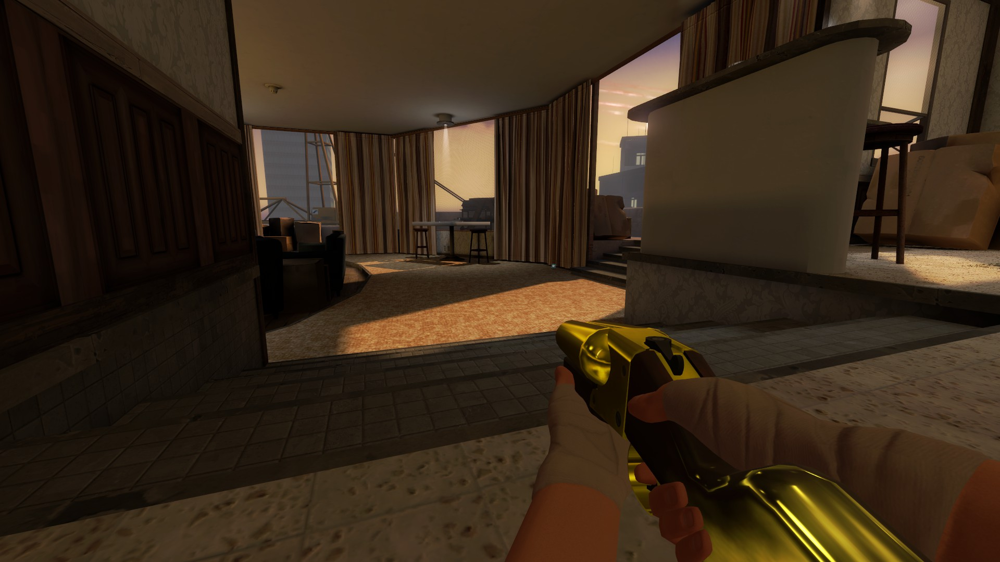
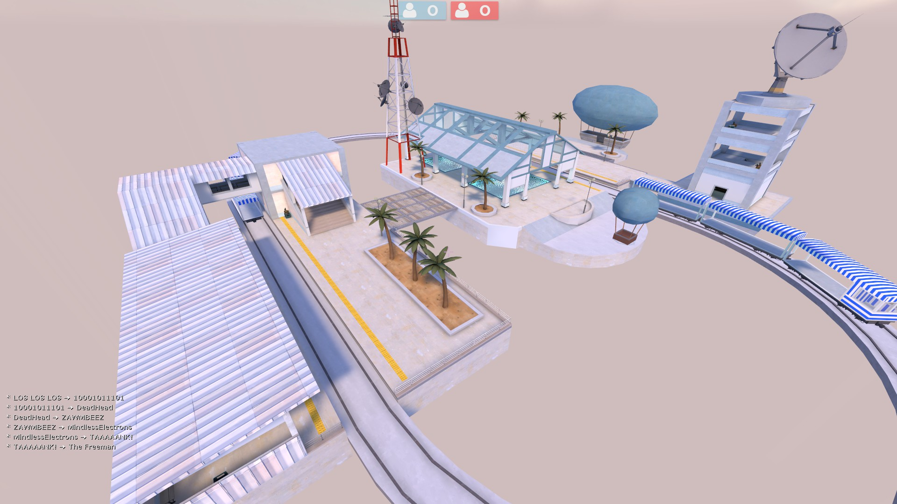
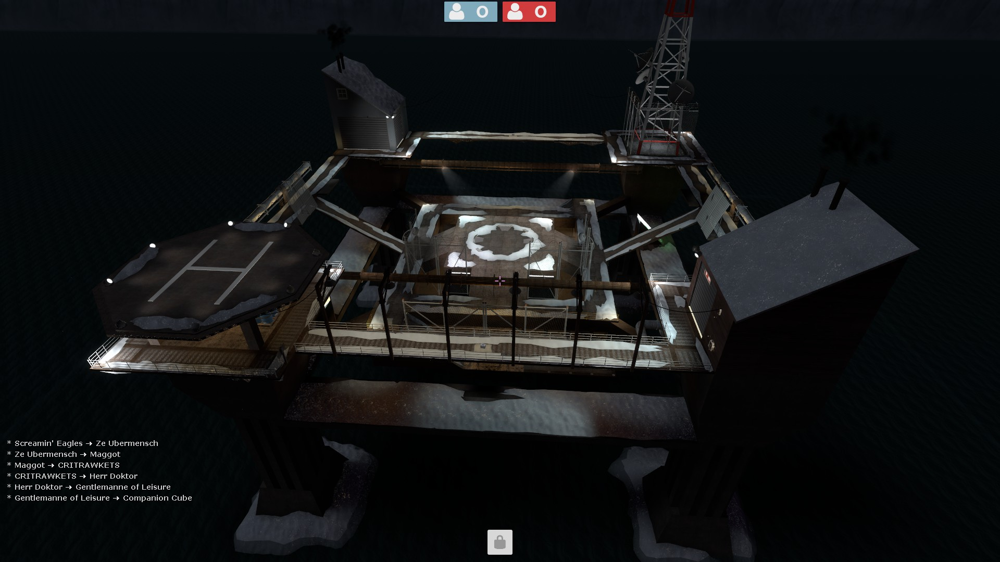
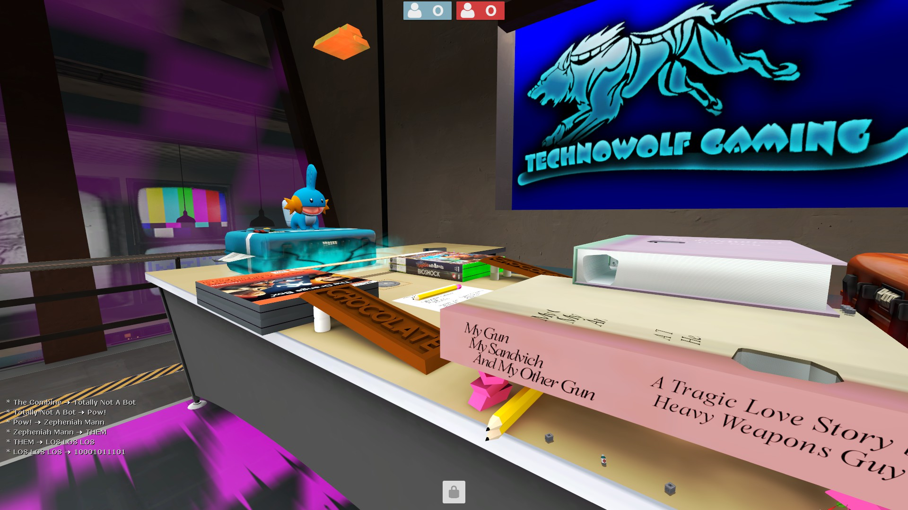
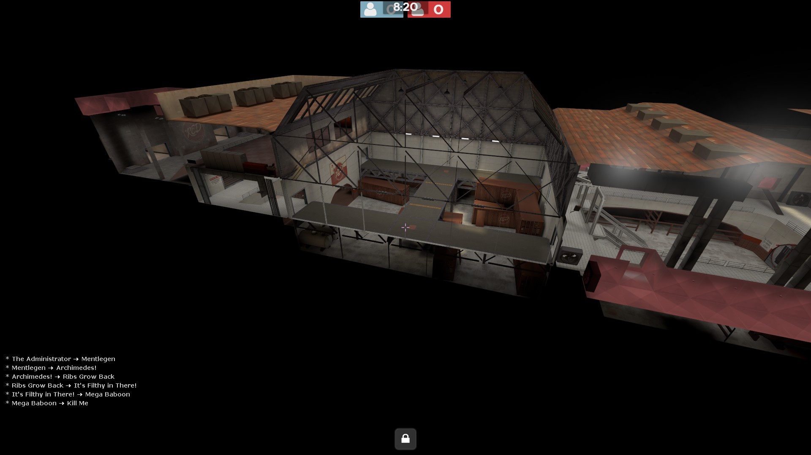
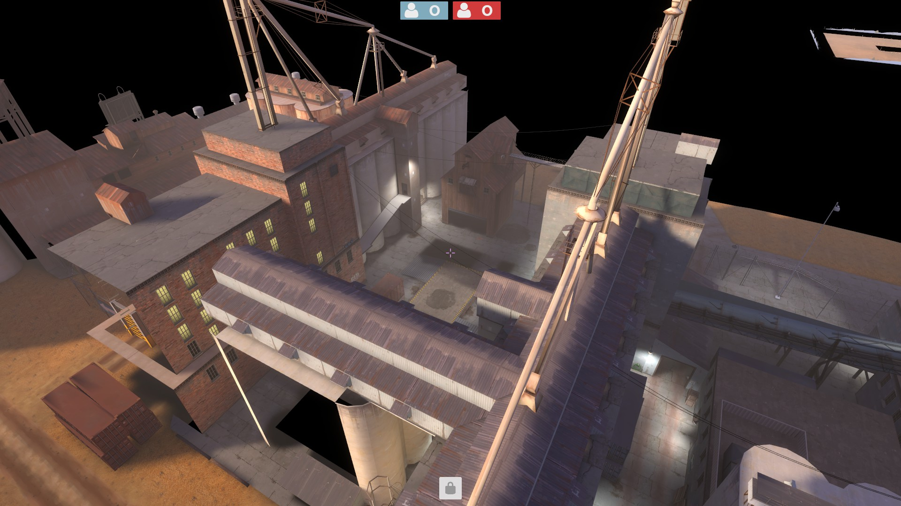
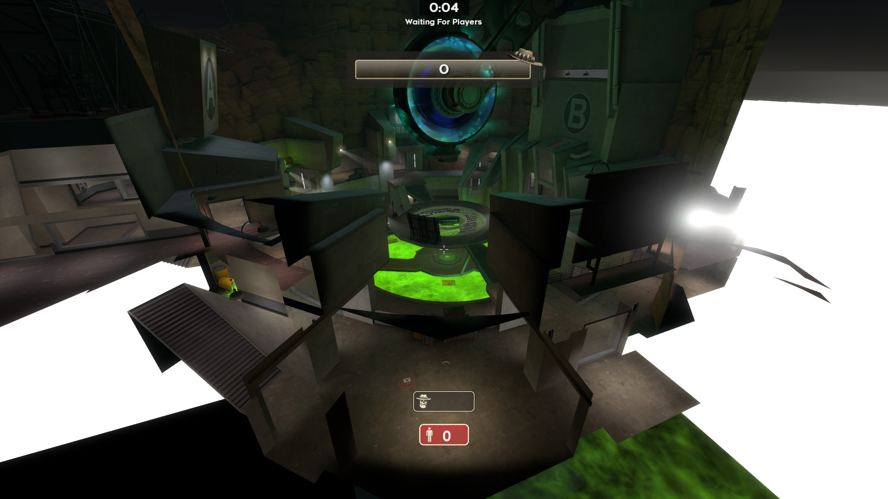

# JuggernautArena — Level Design Brief

*Starter doc for level/map designers. Read this before starting!.*

## 1. What the game is

JuggernautArena (currently a placeholder name for something else when the times comes) is an **asymmetric PvP arena shooter**. Each round:

- **1 player is the Boss** — a hand-picked, custom character with unique health scaling (scales up with attacker count), unique physics (move speed, gravity, hitbox size), and a fixed loadout of unique weapons/abilities. A queue system based off individual performance is what determines who the next player to become the boss is. 
- **Everyone else is an Attacker** — smaller, faster, weaker individually, armed with a chosen loadout of guns/melee/abilities from a shared equipment pool.

The two sides fight in a single arena until time runs out (decided by point/damage totals) or one side is wiped. Think **"5-30 regular players vs. 1 monster,"** not team-vs-team symmetric shooter.

Movement is a **custom Quake/Source-style system** — momentum-based movement is intentional and core to how Attackers evade the Boss. This is not default Roblox walk/jump physics, so maps need to support skill-expressive movement (ramps, ledges, gaps), not flat hallways.

Combat is a mix of **hitscan, projectile, and melee** weapons, all server-validated with lag compensation — meaning fights can happen at range *and* up close regardless of player latency.

My vision for map design comes greatly inspired by the community gamemode in **Valve's *Team Fortress 2* now officially called Verus Saxton Hale (VSH)**. Much of the gameplay loop is similar to this and I will go into more detail on this later on.
## 2. The potential core design issues that need to solve

Every map should be made with a balancing philosophy: **While the boss has greater mobility i.e. speed and movement, they are limited in their range to attack other players. Conversely, attackers have ranged firepower but have low health and slower speed and often get eliminated in a single attack from the boss.**

A good map:
- Gives Attackers **Verticality** from the Boss (Ledges and raised areas) where players can group and nest together and platforms that the player can jump to. These types of spots should give slight advantage to players if they work together however it should not be completely 1 sided for the players. For example, a corner somewhere in the map where it is near impossible for the boss to get to due to very narrow sight lines which would decimate the boss if many players were grouped inside it.
    - These 'vantage' points can be different spots on the map or simply the central area on the map
- Small to medium sized levels would be preferable as **large maps can result in un-engaging situations** where the last remaining players would kite the boss leading to a loop where the boss is unable to catch the player and at the same time not being dealt enough damage.
- **Maps should often follow a theme** for example, a secret lab type of environment. While I am not looking for anything too immersive, the theme should be consistent i.e. props should match the map itself

## 3. Structural requirements (the must-haves)

- **Scale**: needs to comfortably fit a Boss-sized hitbox (some bosses are much larger than a standard Roblox character) moving through doorways, halls, and tight spaces without clipping or getting stuck. Always test geo at the largest boss's scale, not just default R15.
- **Verticality**: meaningful elevation tiers (ground floor, mid platforms, rooftops/catwalks) connected by ramps, stairs, truss/ladaders, jump pads, or strafe-jump gaps — not just elevators. Again your choice of adding environment triggers like jump pads is all based off if the map you are making requires it or not.
- **Environment Interactions**: Areas or spots where interacting or touching them causes something to happen. **Note**: Don't worry about scripting the actual behaviour as I will handle it.
    - Hurt boxes: 
        - under map kill boxes (I have disabled Roblox's core killbox in favour of a custom one) 
        - lava pits
        - the above are just examples. Some maps may or may not even require any environmental triggers. If they are, then they should follow the theme of the map
    - Interactable switches: some maps can have switches that can change parts of the map itself. For example, if players are fighting in a large chamber and someone hits a switch, a large block part that looks like some sort of fluid can rise up and anyone caught inside will take damage.
    - Teleporters: teleport nodes should fit the theme of the map e.g. a jungle map would have a teleport made of roots in a circle etc. or a futuristic map where the teleport would be a large glowing doorway.
    - Jump pads: pretty self explanatory
    - Breakable environment? You don't have to worry about it but bonus points to you if you come up with some sort of map state that can be drastically changed to alter the play through of the round.
    - Feel free to come up with ideas for triggers as I'm more than happy to help implement it

- **Loop-friendly layout**: If building indoor maps or walled structures, multiple paths that loop back into each other so Attackers can juke around the Boss rather than dead-ending.
- **Mix of open and tight spaces**: large-ish central arena/courtyard area for big fights, flanked by tighter rooms/alleys for breaking line of sight.
- **Spawn fairness**: distinct Attacker spawn zone(s) and Boss spawn point, positioned so the Boss/Attackers don't have a free first hit and Attackers aren't instantly cornered.
- **Performance-conscious geometry**: For all maps, stick to low-medium poly geometry for less important details and potentially more details for important and salient things. Client performance and server step time matter more than visual fidelity.
- **No infinite-stall spots**: Ensure no single room/corner where an Attacker can be permanently safe from the Boss, and no spot where the Boss can wall off all approaches.

## 4. Inspirations — broad genre touchpoints

**Asymmetric "hunt the monster" PvP** (closest genre match):
- **Versus Saxton Hale** (Team Fortress 2) — from 1-35 players vs. 1 boss, arena style maps with varying levels of verticality and obstacles. Closest reference to our Boss-vs-Attackers structure.
- **Dead by Daylight** (Behaviour) — 1 killer vs. 4 survivors, loop-heavy maps built around breaking chase lines with structures (the "loop" — a small structure survivors circle to lose the killer). Steal the *loop* concept directly.

**Movement-tech shooters** (for how terrain should reward strafing/bhopping):
- **Quake III Arena / Quake Live** — classic arena maps: ramps, jump pads, rocket-jump-friendly verticality, no flat floors.
- **Apex Legends** — modern movement-shooter map design: rooftops, zip-lines-equivalents, mixed POI density.

## 5. Specific map archetypes we want

Pick from or riff on these — variety across the map rotation matters more than depth on any one:

1. **Industrial Facility** — warehouse/factory interior. Crates and machinery as cover, catwalks above, forklift-scale doorways the Boss can still fit through. (Evolve "Wraith Trap"-style verticality.)
2. **Urban Block** — a few connected buildings, alleys, and a rooftop layer. CS-style chokepoint streets connecting 2-3 open courtyards. Attackers can break vertical sightlines via rooftop hops.
3. **Overgrown Ruins / Temple** — outdoor arena with broken walls, pillars, and elevation changes via rubble ramps. Good testbed for bhop ramps and pillar-juking the Boss.
4. **Underground Complex** — tighter corridors and rooms (sewer/bunker/mine), high tension, short sightlines, good for melee-heavy or close-range bosses; needs extra care that the Boss isn't unstoppable in tight halls.
5. **Open Arena / Colosseum** — a circular or symmetric central pit ringed by elevated platforms — closest to a "pure" Quake arena map, good for a rotation map that's all about movement skill.
6. **Sky** — a map where the ground is made from clouds. There can be a large central cloud with surrounding clouds that are much smaller. Falling off the cloud will result in an instant death. Gives a unique and challenging experience where at any time a mistep can result in falling off the map. 
We are **not** looking for: open battle-royale-scale terrain, realistic large-scale cities, or puzzle/exploration-driven layouts. Every map should be playable start-to-finish as a single combat arena, roughly **comparable in footprint to a CS:GO map** (not MOBA-map scale, not battle-royale scale).

## 6. Deliverable expectations

- Greybox layout first for approval (blocky geometry, correct scale/proportions, marked spawn points) before any art pass.
- Test pass at Boss scale (we'll provide a placeholder oversized rig) to confirm no clipping/stuck spots.
- Final geometry should use `SpawnArea`-tagged parts for spawn zones and avoid blocking weapon raycasts unintentionally (flag any glass/thin geo that needs the `RayExclude` tag or just inform me).
- Keep part count and unique meshes reasonable

## 7. Examples ##
**The following images are screenshots taken from TF2** (Versus Saxton Hale community maps)

*Close-quarters interior space but with the thematic twist that you are miniaturised fighting in a living room*

*Top-down view of a themed outdoor map — consistent "floating resort" theme across props with a moving train that can be stood on*

*Oil rig setting with a central arena platform ringed by connected sub-platforms. Falling off the rig is an instant death*

*A table top with props positioned in a way and modeled in a way that can be stood on or entered with jump pads allowing players to get on top of the books*

*Industrial warehouse arena — crates as cover, exposed steel truss roof, multiple connected bays. Close match to the "Industrial Facility" archetype above.*

*The image isn't that great but the map is smaller than what is shown. The middle has 4 cargo containers that can be stood on in the middle but 2 of them are not visible due to rendering optimisations*

*Sci-fi central arena with a literal environmental hazard (green pit) under a circular platform — good reference for the "Environment Interactions / hurt boxes" requirement in section 3.*
